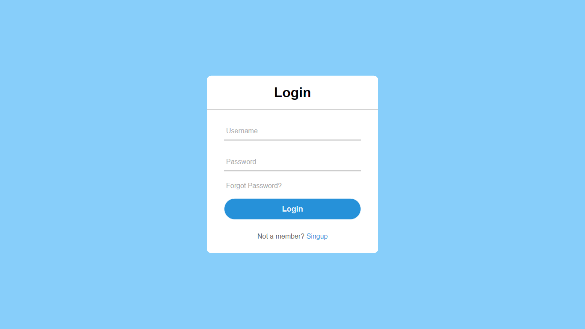
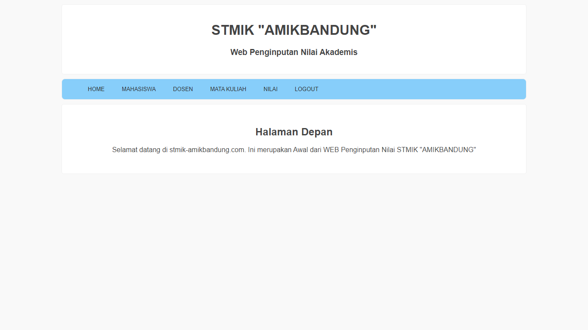

# Simpe CRUD with PHP

Ini adalah sebuah projek yang dilaksanakan untuk memenuhi tugas MID TEST Database Implementation SQL & NoSql.

## Tampilan dari Simple CRUD with PHP
++ Halaman LogIn

++ Halaman Home


## Note
```
Pastikan sudah terpasang XAMPP dan menyalakan Apache + MySQL
```

## Cara Pasang
1. Pindahkan folder src ke C:\xampp\htdocs\
2. Buat database dengan nama akademik dengan mengakses http://localhost/phpmyadmin/
3. Lalu import file akademik.sql ke dalam database yang sudah dibuat tadi
4. Kemudian buka project tadi dengan cara ketik http://localhost/src/ di web browser
5. Masukkan Username (admin) dan Password (admin123)

> Note: `find a bug? it's features haha.`